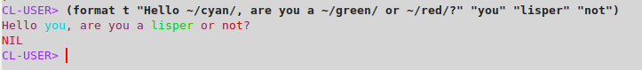

Simple `format` directives to print in colors:

~~~lisp
(use-package :format-colors)
;; or import from :format-colors the symbols :red :blue :yellow :green :cyan :black :white :magenta.
(format t "Hello ~/cyan/, are you a ~/green/ or ~/red/?" "you" "lisper" "not")
~~~

=>

<!-- <span>Hello <span style="color: cyan">you</span>, are you a <span style="color: green">lisper</span> or <span style="color: red">not</span>? -->



Instead of (with `cl-ansi-text`):

~~~lisp
(use-package :cl-ansi-text)
(format t "Hello ~a, are you a ~a or ~a?" (cyan "you") (green "lisper") (red "not"))
;; or
;; (format t "Hello ~a, are you a ~a or ~a?" (cl-ansi-text:cyan "you") (cl-ansi-text:green "lisper") (cl-ansi-text:red "not"))
~~~

Let's see how it goes.

LLGPL

---

ps: to enable colors in Slime, one solution is [M-x slime-repl-ansi-on](https://github.com/deadtrickster/slime-repl-ansi-color/) (in MELPA).

``` lisp
(with-eval-after-load 'slime-repl
  (require 'slime-repl-ansi-color))
(add-hook 'slime-repl-mode-hook 'slime-repl-ansi-color-mode)
```
